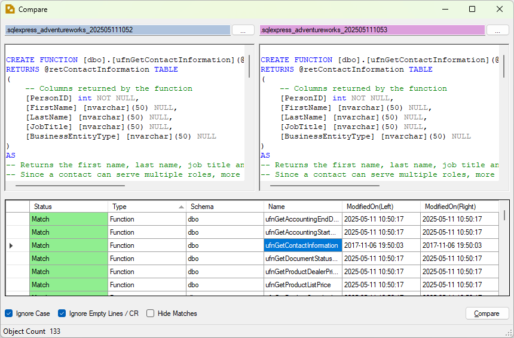
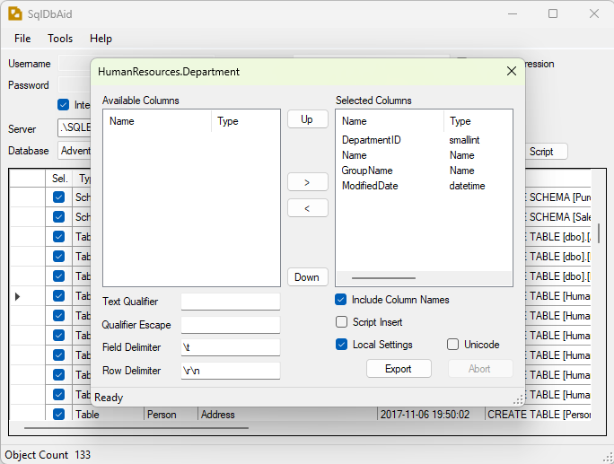
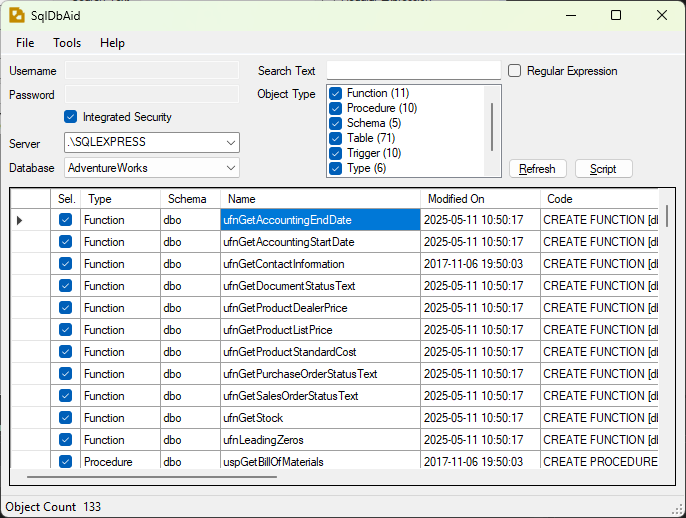
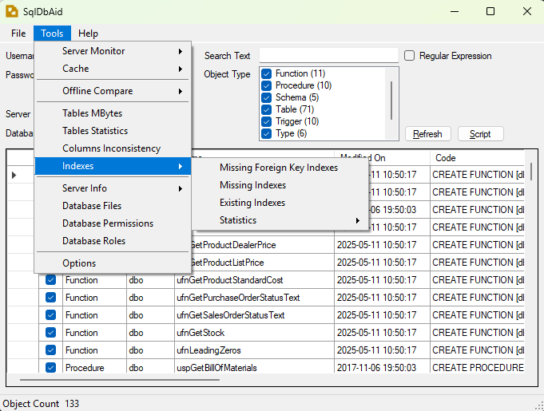

# SqlDbAid

  

SqlDbAid is an intuitive standalone application that enables you to easily script database items and data for SQL Server 2005 and later versions. It's a powerful tool for database developers and administrators to manage, compare, and export SQL Server database objects and data.

## Features

### Database Object Scripting
- Script tables, views, stored procedures, functions, and other database objects
- Support for schemas
- Syntax highlighting for SQL code

### Database Comparison

  

- Compare database objects between different databases
- Identify renamed objects
- Generate change scripts

### Data Export

  

- Export data to various formats (Text, Script, Table)
- Customizable export settings (delimiters, text qualifiers, etc.)
- Support for Unicode

### Database Reports
- Generate "Database Permissions" reports
- Analyze database structure and security

### User-Friendly Interface

  

- Intuitive menu system

  

- Windows authentication and SQL Server authentication support
- Configurable connection timeout

## System Requirements

- Windows operating system
- .NET Framework 4.8
- SQL Server 2005 or later
- Appropriate database permissions (VIEW SERVER STATE, VIEW DATABASE STATE for some features)

## Installation

1. Download the latest release from the [Releases](https://github.com/flashmood69/SqlDbAid/releases) page
2. Extract the ZIP file to your preferred location
3. Run SqlDbAid.exe

No installation is required as SqlDbAid is a portable application.

## Usage

### Connecting to a Database

1. Launch SqlDbAid
2. Enter your SQL Server instance name
3. Choose authentication method (Windows or SQL Server)
4. If using SQL Server authentication, enter your username and password
5. Click "Connect"
6. Select a database from the dropdown list

### Scripting Database Objects

1. Connect to a database
2. Select the object types you want to script
3. Choose specific objects or select all
4. Click "Script" to generate the SQL scripts

### Comparing Databases

1. Connect to a database
2. Click on the "Compare" button in the toolbar
3. Configure source and target database connections
4. Select object types to compare
5. Click "Compare" to see differences

### Exporting Data

1. Connect to a database
2. Click on the "Export" button in the toolbar
3. Enter your SQL query or select a table
4. Configure export settings (format, delimiters, etc.)
5. Click "Export" to generate the output file

## License

This is free and unencumbered software released into the public domain. See the [LICENSE](LICENSE) file for details.

## Changelog

See the [CHANGELOG.md](CHANGELOG.md) file for details on version history and updates.

## Contributing

Contributions are welcome! Feel free to submit issues or pull requests to help improve SqlDbAid.

## Support

For support, please open an issue on the [GitHub repository](https://github.com/flashmood69/SqlDbAid/issues).